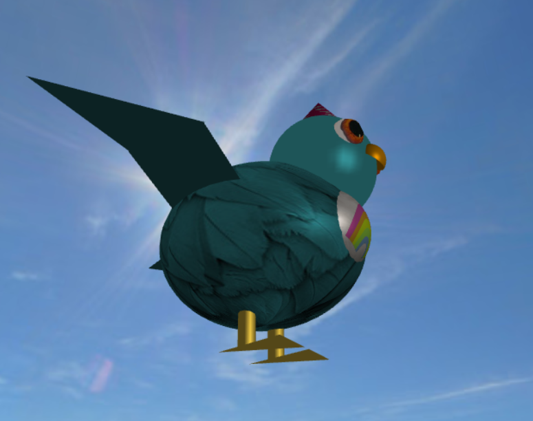

# CG 2022/2023

## Group T10G03

## Project Notes

### Textures Used
- [Nest](https://3dtextures.me/2022/03/27/stylized-roof-thatched-002/)
- [Egg](https://wildtextures.com/free-textures/seamless-polka-dot-paper-fabric-textures/) (some modifications on FireAlpaca, including color change)
- Bird
    - [Body](https://stock.adobe.com/search?k=bird+feather+texture)
    - [Eye](https://www.3dxo.com/textures/5928_eye_brown) (some modifications on FireAlpaca, on its size)
    - [Hat](https://wildtextures.com/free-textures/seamless-polka-dot-paper-fabric-textures/) (the same as the egg)
    - [Front Fur](https://www.google.com/search?q=carebear+bellies&tbm=isch&chips=q:care+bear+belly,g_1:rainbow:mgBgaaka0vE%3D&client=firefox-b-d&hl=en&sa=X&ved=2ahUKEwiWrNLFmYL_AhU2nCcCHd13CqUQ4lYoBHoECAEQMw&biw=1519&bih=676#imgrc=CLS-pICF7ZvaDM)

The restant textures were created by us or given in the project.

### Screenshots

