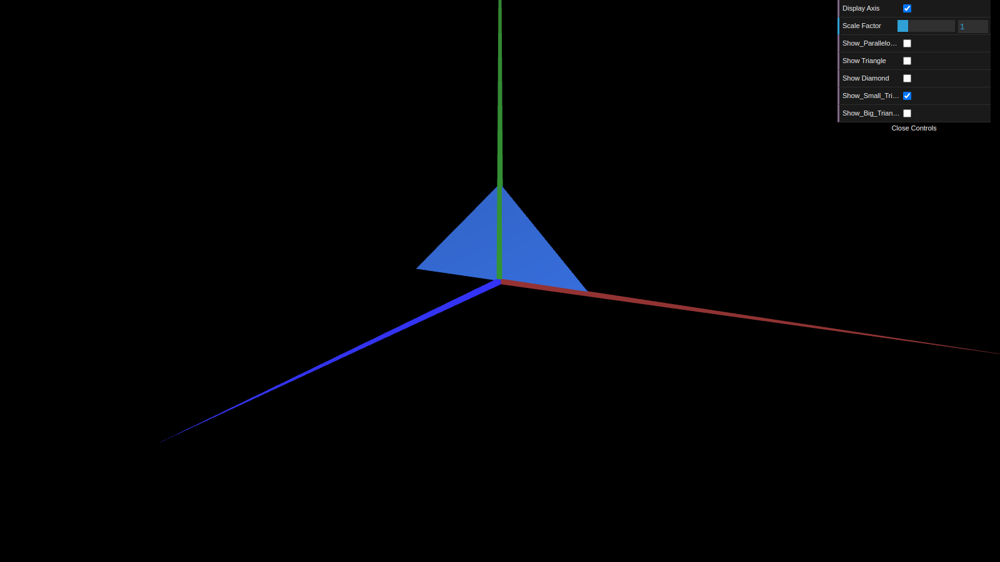
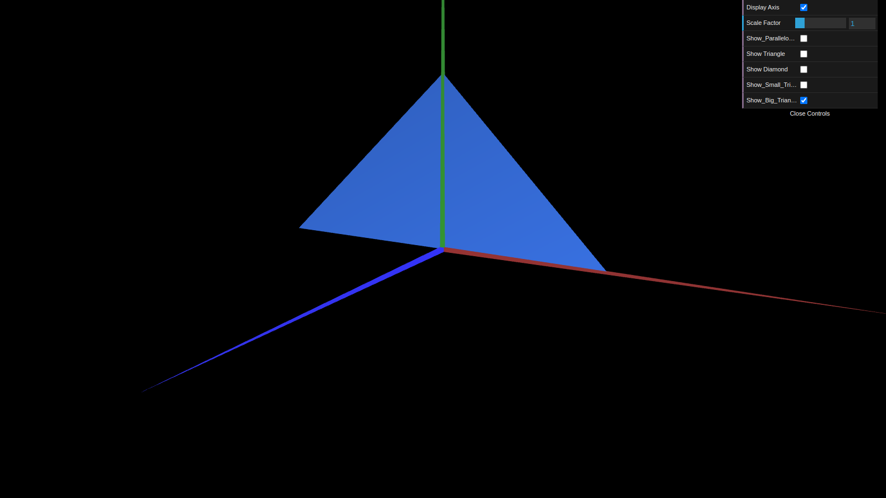

# CG 2022/2023

## Group T10G03

## TP 1 Notes

- In exercise 1 we learned how to draw by creating triangles using points and specifying which points create a triangle in a certain order so that it is drawn to the camera when we initialize the scene for the first time.
- In exercise 1 we also learned how to add a checkbox to the GUI and with that being able control whether a certain figure is drawn or not.
- In exercise 2 we put in practice what we had learned in the exercise before.

