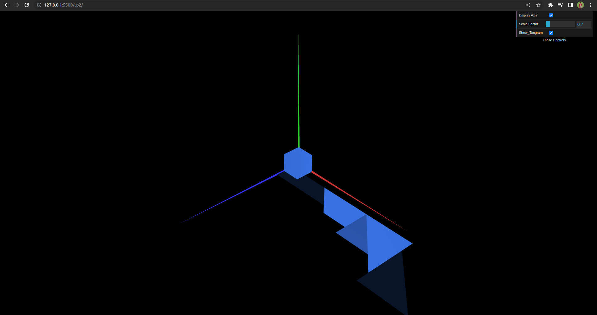
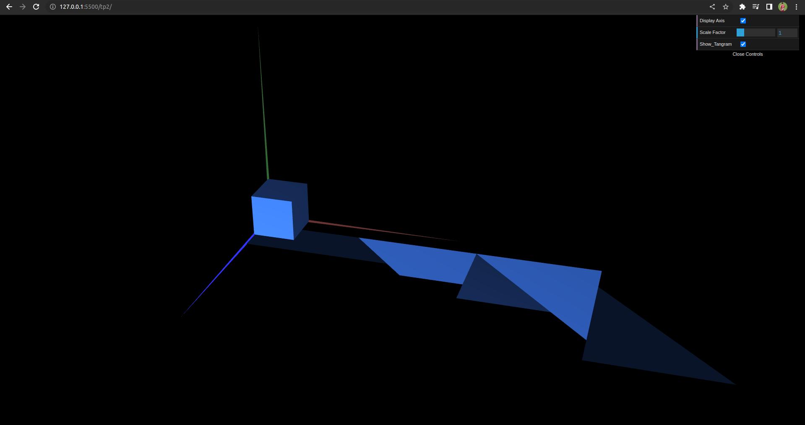

# CG 2022/2023

## Group T10G03

## TP 2 Notes

- In exercise 2 we learned how to translate, scale and rotate a figure, we initially struggled with the matrix calculation but eventually managed to succeed.
- In exercise 3 we created a cube easily as it required no transformations, however we found it a little bit more difficult to transform the tangram to the correct place.
- In exercise 4 we took advantage of some code obtained in the exercises before to accomplish the cube.

